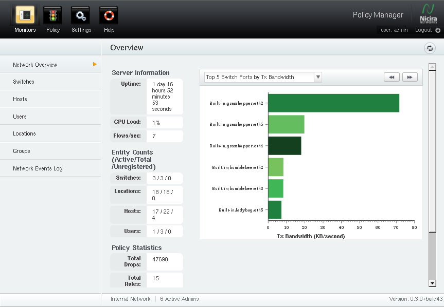
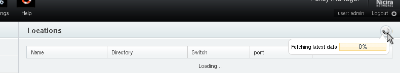
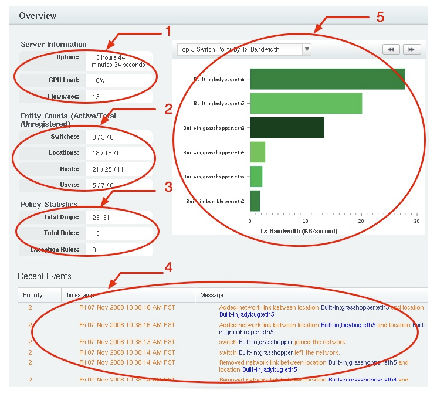

.. _overview:

Policy Manager Overview
==============================

Application Orientation
------------------------

The Policy Manager application is a graphical user interface for
viewing and controlling all network policy and configuration state. 
An example screen shot of the policy manager is shown below.

Functions in Policy Manager are grouped into high-level categories which
are available through icons in the top pane.  As shown in the example
screen shot, these include *Monitors*, *Policy*, *Settings*, and *Help*.
Each of these groupings includes multiple pages that can be reached
from links displayed in the left side-bar. 

Briefly, the *Monitors* section contains a collection of pages for most
day-to-day management tasks such as reviewing the system status and
managing network principals.  The *Policy* section provides a
comprehensive interface to the network security policy.  The *Settings*
section is used to configure the Policy Manager for a particular network
setting.

All pages in the Policy Manager are bookmarkable allowing for
quick access to any page within the system.  Most pages update automatically
to keep displayed information consistent 
with the internal state of the Policy Manager.  In addition, all pages have
a progress indicator which indicates whether a page is loading, and on
mouse-over the progress until the loading is complete (shown below). 

The bottom bar of the application shows the network name (configurable
from the *Settings* section), the number of users logged on to the
application, and the application version.

Quick Setup
-----------

The following steps are necessary for a basic configuration of the Policy
Manager. 

1. At least one switch must be registered at the Policy Manager.
Configuring a switch to work with the Policy Manager is described in
:ref:`switch_management`. 

2. By default, the Policy Manager is configured with a self-signed
certificate which is used both for the management interface and the
captive web portal.  This should be replaced with a valid root-signed cert 
(see :ref:`conf-web-interface`).

3. Hosts that are required for core network operation (such as DNS servers or
directory servers) should be registered with the Policy Manager and
added to correct host groups.  This allows for default connectivity
required for host and user authentication.  This is described in more
detail in :ref:`default-policy`.

4. To authenticate users over HTTP, the captive web portal must be
configured with the domain name of the Policy Controller (see
:ref:`conf-captive`).

5. Finally, hosts can be registered manually or as they are discovered
and placed into groups for the policy.  Managing hosts is described in
:ref:`host_management` and modifying the network policy in :ref:`policy`. 

Monitors
---------

The Monitors section of the Policy Manager application contains the
pages where most day-to-day operation of the system 
takes place. To reach the Monitors section, click on the *Monitors* icon
in the navigation bar at the top of the application:

.. image:: monitor_icon.png

Each of the pages in the *Monitors* subsection are described below.

Network Overview
^^^^^^^^^^^^^^^^^

The Network Overview page is the default page of the Policy Manager
application and provides a summary view of the network state.  The
major sections are describe below.

1. The *Server Information* fields contain information regarding the Policy
   Manager server itself.  This includes the uptime, CPU load and the
   number of flows per second that are being processed network-wide.

2. The *Entity Counts* provide an overview of all principals known to the
   policy manager.  For each of the principal types (switch, locations,
   hosts, and users) the following information is shown:

   * The number of entities currently active on the network.

   * The total number of entities (active or inactive) registered at 
     the Policy Manager.

   * The number of entities that have been observed on the network for
     which there is no registration information.

3. *Policy Statistics* provide general information regarding the
   configured network policy.  This includes the total number of network
   flows which have been denied by the policy and the number of rules
   of the active policy. The number of configured exception rules is also
   shown (exception rules are described in :ref:`policy`).

4. *Recent Events* show a list of recent network events.  This is only
   includes events of priority greater than 2 from the Network Event Log
   (described below in :ref:`overview-event-log`).

5. The *Heavy-Hitters Graph* contain various load graphs showing the
   most active network components.  Clicking on the left and right double
   arrows will cycle through the set of available graphs.

Principal Management Pages
^^^^^^^^^^^^^^^^^^^^^^^^^^

The *Switches*, *Hosts*, *Users*, *Locations*, and *Groups* pages in the
*Management* section all deal with viewing and managing principals.  These
functions merit there own section and are described in detail in
:ref:`principals`.

.. _overview-event-log:

Network Event Log
^^^^^^^^^^^^^^^^^^^

The Network Event Log is a running list of network-wide events which may
be used for monitoring and debugging network behavior.  The events are
prioritized from 1-5 where lower numbers are considered to have higher
priority.  In general, the network event log messages only include the
high-level names of principals.  Each principal name is a link to the
management page for the principal which contains detailed information
regarding that principal.   

