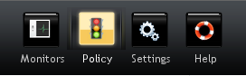
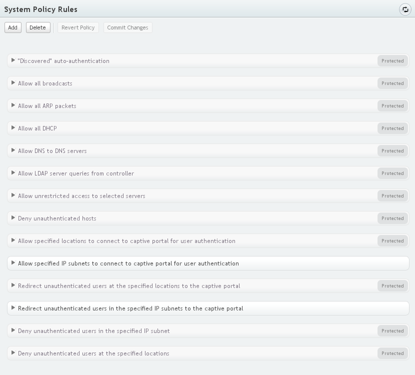
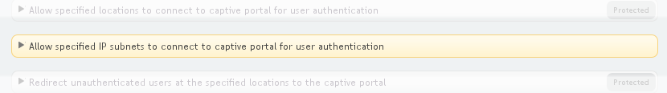
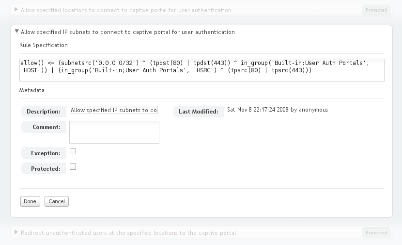
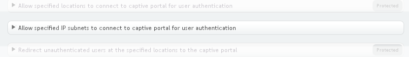
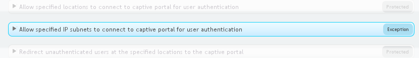
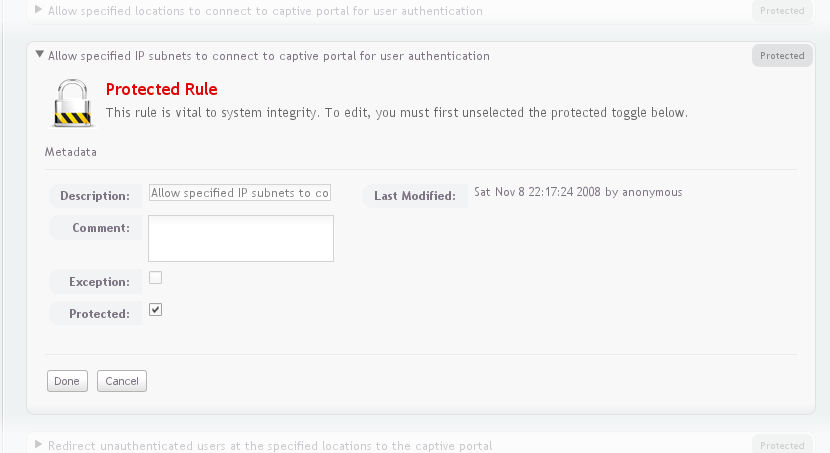
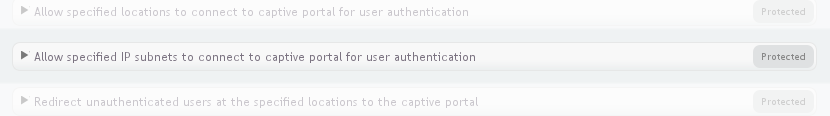
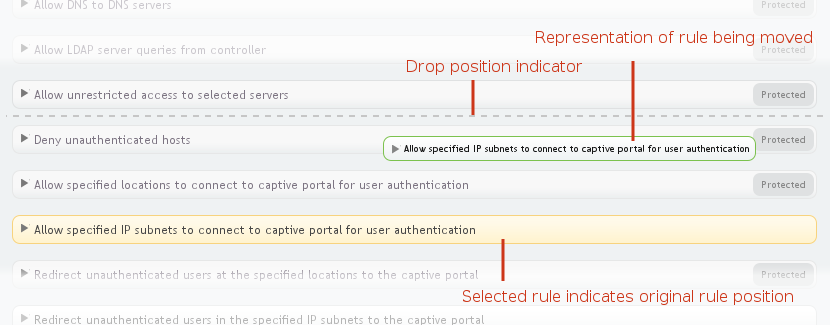

.. _policy:

Defining Network Policies
==========================

Overview
---------

Network policies are created and modified in the Policy section of the
Policy Manager application.  To reach the policy section, click
on the Policy icon in the navigation bar at the top of the application:

Policy rules are split into two sub-pages, *System Policy* and *Site
Policy*.  Generally, System Policy rules are fundamental to the
operation of the system, while Site Policy rules are customizations
implementing behavior unique to a particular site.  All System Policy
rules are evaluated before Site Policy rules, so System Policy rules
will take precedence during operation.

A default policy is provided with the system.  In many cases, the
behavior of this policy can be adjusted to match the requirements of
the organization by modifying the group membership of groups over
which the policy is written.  When the default policy is not
appropriate, the default rules can be edited.  The mechanics of policy
editing are the same for all policy pages and are covered in the next
section, `Basic Policy Editing`_.  The following section, `Using the
Default Policy`_, gives a detailed description of the default policy
and how to adjust its behavior.  Finally the language in which rule
specifications are written is described in the `Policy Rule Language`_
section.

Basic Policy Editing
---------------------

Both policy pages have the same format, a set of action buttons at the
top of the page to manipulate the policy, and a list of rules:

The following action buttons are available:

    Add
        Add a new rule to the policy.  The new rule will be inserted
        above the currently selected rule or at the top of the policy
        if no rule is selected.
    Delete
        Delete the currently selected rule.  If no rule is selected,
        this button has no effect.
    Revert Policy
        If the policy has been changed, this button discards all 
        changes that have been made since the last commit.  It is 
        inactive otherwise.
    Commit Changes
        If the policy has been changed, this button commits the
        changes to the server and makes them active on the network.
        It is inactive otherwise.  **Remember to commit changes before
        navigating to another page in the browser, or all changes will
        be lost.**

Policy rules are presented in an ordered list with earlier rules
taking precedence over later ones.  Initially all rules are
shown in a collapsed form, in which only the description or
specification of the rule is shown, and most other information about 
the rule is hidden.

To select a rule to apply one of the action buttons at the top of the
screen, click on the rule.  The rule will be colored orange to
indicate it is the currently selected rule:

Double-clicking on a rule expands the rule so that all information
about the rule can be viewed and edited:

The following fields are available in the expanded view:

    Rule Specification
        The specification of the rule in the policy rule language.
        This language is described in the `Policy Rule Language`_
        section.
    Description
        A description of the rule.  The collapsed form of the rule
        displays this text unless it is not specified, in which case
        the text from the Rule Specification field will be
        displayed.
    Comment
        A free-form comment that can be used to document the purpose
        of the rule or for any other purpose.
    Exception
        Sets the rule status to "exception".
    Protected
        Sets the rule status as "protected".
    Last Modified
        The date, time, and username of the user that last modified
        the rule.  This is generated automatically and can not be
        edited.

To complete editing of a rule, left-click the "Done" button to 
locally save any changes that have been made or the "Cancel" button 
to discard them.

Selecting combinations of the "Exception" and "Protected" changes the
state of the rule which in turn affects its appearance and behavior.
When neither of the fields are checked, the rule is a
"normal rule".  In the collapsed view, it is shown with black text and
no special status "badge" on the right-hand side of the rule:

When only the "Exception" field is checked, the rule is an "exception
rule".  Marking a rule in this way does not affect the
rule's behavior--it simply provides a visual reminder to operators that
it may need further attention.  It is shown in a light-blue color 
in the collapsed view of the rules with a badge indicating the rule 
is an exception on the right-hand side of the rule:

When only the "Protected" field is checked, it is a "protected rule".  In
this state, most of the fields in the expanded form of the rule are no
longer editable:

In the collapsed form, the rule description is shown in a light grey
and there is a badge indicating the rule is protected on the
right-hand side of the rule:

In addition to disabling changes in the expanded view, protected rules
can not be selected in the collapsed view and thus can not be deleted.

When both the "Exception" and "Protected" fields are checked, the rule
behaves as a protected rule.

Rules are reordered using drag-and drop.  To drag a rule, click
on the collapsed rule representation, keep the mouse button depressed,
and drag the rule to the desired position.  While dragging, a smaller
version of the rule will move with the cursor to remind you of the
rule you are reordering.  A dashed line will indicate where the rule
will be moved when it is dropped.

Remember that protected rules can not be selected, so they can not be
moved by drag-and-drop either.  To move a protected rule, it must
first be unprotected.

.. _default-policy:

Using the Default Policy
-------------------------

All but one of the rules of the default policy are contained in the
System Policy.  This section describes each rule one by one in the
order they are presented in the policy, which is also the order in
which they are evaluated.  Most of the rules are protected because
they should not generally need modification.  If modification of a
rule is required, it must first be set to unprotected.

In the System Policy, the rules are:

    "Discovered" auto-authentication
        Authenticates hosts by source MAC address.  If the source MAC
        address is known, the host will be given the associated name.
        If the MAC address is unknown, a dynamically generated name
        will be used.

    Allow all broadcasts
        Allow broadcast traffic.  Broadcast traffic is important for
        address resolution and service discovery.  Many hosts will not
        operate properly on the network if broadcasts are not allowed.
        If the behavior of hosts on the network is known in detail,
        this rule can be replaced with more restrictive rules allowing
        only the required broadcast traffic.

    Allow all ARP packets
        ARP is the "address resolution protocol".  If this protocol is
        not allowed hosts will not be able to communicate on the
        network.

    Allow all DHCP
        DHCP is the "dynamic host configuration protocol".  This is
        usually required for hosts to be able to dynamically obtain 
        addresses on the network.  If DHCP is not in use, the rule 
        can be deleted.

    Allow DNS to DNS servers
        DNS servers allow hosts to lookup network addresses based on
        more memorable names.  This rule restricts DNS to known
        servers by requiring the DNS servers to be in the
        'Built-in;DNS Servers' group.  This group should be populated
        with the list of valid DNS servers.

    Allow LDAP server queries from the controller
        When the policy manager is used with an external LDAP
        directory, it must be able to send LDAP queries and receive
        responses from the LDAP servers.  This rule also uses groups
        to establish valid controllers and LDAP servers.
        The"Built-in;Controllers" and "Built-in;LDAP Servers" groups
        are used respectively.

    Allow unrestricted access to selected servers
        Some servers may need unrestricted access to the network to be
        able to serve both authenticated and unauthenticated hosts.
        To give a host unrestricted access, add it to the
        "Built-in;Unrestricted Servers" group.

    Deny unauthenticated hosts
        This rule denies all communication from hosts that have not
        been authenticated.  Since the first rule of the default
        policy automatically authenticates all hosts, this should not
        have any effect with the default policy.  However, it marks
        the point after which all rules can assume that the host
        involved has been authenticated

    Allow specified locations to connect to captive portal for user authentication
        For user authentication using the captive web portal, hosts
        must be able to reach the captive web portal before the users
        are authenticated.  This rule allows such communication when
        the host is redirected based on its location in the network.
        See the associated redirect rule lower in the policy for
        details.

    Allow specified IP subnets to connect to captive portal for user authentication
        As an alternative to specifying locations from which a user
        must be authenticated at the user authentication portal, a set
        of IP subnets can be specified.  See the associated redirect
        rule lower in the policy for details.  As with the redirect
        rule, this rule is not protected because there is no default
        subnet that is valid for all networks.

    Redirect unauthenticated users at the specified locations to the captive portal
        Redirects HTTP to the captive portal for specific locations on
        the network when the user of a host is not yet authenticated.
        Individual locations can be specified by adding them to the
        "Built-in;User Auth Portal Locations" group.  All ports on a
        switch can be specified by adding the switch to the
        "Built-in;User Auth Portal Switches" group.  Finally, to
        ensure proper communication, the policy manager host(s) must be
        added to the "Built-in;User Auth Portals" group.

    Redirect unauthenticated users  in the specified IP subnets to the captive portal
        As an alternative to specifying locations from which user must
        be authenticated at the user authentication portal a set of
        subnets can be specified instead.  If the source address is
        within the subnet specified and the user has not been
        authenticated yet, HTTP will be redirected to the auth portal.
        As for the previous rule, the policy manager hosts must be
        specified in the "Built-in;User Auth Portals" group.  This
        rule is not protected because there is no default subnet that
        will be valid for all networks.  The rule should be edited to
        specify appropriate subnet(s).  If it is not changed, it will
        not match any traffic.

    Deny unauthenticated users in the specified IP subnet
        For IP subnets where user authentication is required, this
        rule drops all traffic from a host that does not have an
        authenticated user.  It relies on the groups required by the
        IP subnet-based redirect rule above.

    Deny unauthenticated users at the specified locations
        For locations where user authentication is required, this
        rule drops all traffic from a host that does not have an
        authenticated user.  It relies on the groups required by the
        location-based redirect rule above.

In the Site Policy, the single default rule is:

    Allow all traffic
        This rule allows all traffic that hasn't been denied in the
        System Policy.  Remember that system policy rules always take
        precedence.

Policy Rule Language
----------------------

The rule specification for each policy rules is written in a special
rule language.  Each rule has the form:

    *action* <= *condition*

The *action* part of a rule must be one of:

    allow()
        Allow matching traffic.
    deny()
        Deny matching traffic.
    authenticate_host()
        Automatically authenticate the sending host.
    http_redirect()
        Redirect matching traffic from sender to the captive web
        portal for user authentication.  Note that the condition should
        limit this to unauthenticated users sending traffic over
        HTTP.

The *condition* part of a rule specifies the network traffic to which
the *action* applies.  It consists of one or more primitives matching
information about the network connected by logical operators.  The
primitives are:

    dlvlan(*vlan tag*)
        Flow's vlan tag.  Argument is either an integer in the range
        0-4095 specifying a vlan tag, or OFP_VLAN_NONE to match flows
        without a vlan.
    dlsrc(*mac address*)
        Source link layer address.  Argument is the address as either
        an integer or a colon-separated string.
    dldst(*mac address*)
        Destination link layer address.
    dltype(*data link protocol id*)
        Protocol specified in link layer header.  Argument is an
        integer in the range 0-65535.
    nwsrc(*address*)
        Source network layer address.  Argument is the address as
        either an integer or a string in the normal dotted octet
        format used for IP addresses.
    nwdst(*address*)
        Destination network layer address.
    nwproto(*network protocol id*)
        Protocol specified in network layer header.  Argument is 
        an integer in the range 0-255.
    subnetsrc(*ip subnet*)
        Subnet source IP is a member of.  Argument is a CIDR
        subnet identifier (e.g., '192.168.1.0/24').
    subnetdst(*ip subnet*)
        Subnet destination IP is a member of.
    tpsrc(*port number*)
        Source transport port.  Argument is an integer in the range
        0-65535.
    tpdst(*port number*)
        Destination transport port.
    locsrc(*location name*)
        Source location name.
    locdst(*location name*)
        Destination location name.
    hsrc(*host name*)
        Source host name.
    hdst(*host name*)
        Destination host name.
    usrc(*user name*)
        Source user name.
    udst(*user name*)
        Destination user name.
    conn_role(*direction*)
        Role unidirectional flow plays in the connection.  Valid
        values are 'REQUEST' and 'RESPONSE'.
    protocol(*protocol name*)
        Convenience method for specifying dltype, nwproto, and/or
        transport ports using the associated common protocol name.
        Currently accepted protocol names are: arp, ipv4, tcp, udp,
        icmp, ipv4_icmp, ipv4_tcp, ipv4_udp, http, dhcpc, dhcps,
        dhcp6c, dhcp6s, tcp_http, ipv4_tcp_http, ssh, dns.
    in_group(*group specification*, *primitive*)
        Check whether the flow attribute specified as *primitive*
        (chosen from the above primitive types with the name in all
        capitalized letters and no argument in parenthesis) is included
        in the group specified by *group specification*, which can
        consist of either a name for a group specified elsewhere or a
        list of values valid as arguments to the specified primitive
        type, enclosed in square brackets and separated by commas.

Note that all arguments to primitives--with the exception of plain 
integers--must be quoted (e.g., nwsrc("192.168.1.10") and tpdst(80)).

The logical operators are specified on conditions consisting of any of
the above primitives or further nested logical expressions.  They are
in order from highest to lowest precedence:

    **~** *condition*
        Evaluate the logical negation of the specified condition.
    *condition1* **^** *condition2*
        Evaluate the logical AND of two conditions.
    *condition1* **|** *condition2*
        Evaluate the logical OR of two conditions.

Operators group from left to right.  Parentheses can be used in the 
expected way to affect grouping and precedence of matching.
