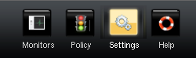

.. _system-conf:

System Configuration
=====================

General system configuration options can be reached from the settings
icons on the top pane.

The following subsections describe common configuration tasks.

.. _conf-web-interface:

Web Interface Settings
-----------------------

It is possible to change the TCP ports used by the Policy Manager's web
interface as well as the SSL certificate.  These configuration options
are available in the *Settings* section under the *Policy Controller*
link.  

We strongly suggest that the self-signed certificate be replaced with a
valid root-signed certificate as soon as possible as this is also used by the
captive web portal.

Configuring DHCP
------------------

The Policy Manager can function as a DHCP server.  The configuration
options for the DHCP server can be found by clicking on the *Settings*
tab, and then the *DHCP* link on the left side bar.  The DHCP server
is not enabled by default.  To enable it, you must add at least one IP
subnet to the DHCP lease pool under the *Subnets* section. 

General Configuration
^^^^^^^^^^^^^^^^^^^^^

General DHCP configuration parameters can be entered under the *General
Options* heading.  These include the default and maximum DHCP lease
times, and the default DNS server to return to DHCP clients.  To edit
the fields, simply double click on the field values.  Note that to save
changed you **must** click on the *Commit Changed* button.  Failure to do
this will result in the loss of all entered data if you navigate away
from the page.

Per Subnet Configuration
^^^^^^^^^^^^^^^^^^^^^^^^

The DHCP server can be configured to serve IPs from multiple IP subnet
pools.  Each subnet may include its own gateway (Router Address),
default search domain (Domain Name), and DNS servers.  If no DNS server
is specified, the default DNS server under the general configuration
options is used.

Fixed Addresses
^^^^^^^^^^^^^^^^^^^^^^^^

Fixed Addresses specify a static binding so that the same host will
always receive the same IP address.  Fixed addresses can only be
declared over hosts that have been registered at the Policy Manager.

.. _conf-captive:

Configuring the Captive Web Portal
----------------------------------

The captive web portal is used for HTTP-based user authentication (see
:ref:`policy` for instructions on configuring the Policy Manager to
redirect unauthenticated users to the captive web portal).  To configure
the appearance of the login page and the duration of user credentials, 
click on the *Settings* tab, and then the 
*Captive Portal* link in the left side bar.

Note that on setup, it is **required** that the *Captive Portal Web Server* 
field be set to the DNS name or IP address of the Policy Manager.

Configuring NAT
---------------

Any switch port can be configured to perform SNAT (Source Network
Address Translation).   

Under the *Monitors* tab, click on the *Switches* link and select
the target switch.  On the switch page, under the *Ports* heading, you
will need to choose the port for which you plan to configure NAT.

To enable NAT, simple click on the *enable NAT* link under the *NAT
Configuration* heading and specify the external IP address(es) to map
the internal addresses to.  By default, all traffic sent through the
NAT port will be NAT'd, however this can be limited by IP prefix, or
port number by clicking on the *limit hosts* or *limit ports* links.

In order for the changes to take effect, you must click on the *Commit
Changes* button.

.. _conf_ldap:

Configuring an External Directory Server
----------------------------------------

The Policy Manager supports integration with an external directory
server (either OpenLDAP or Active Directory) to handle user
authentication.   

Preparing your Directory Server
^^^^^^^^^^^^^^^^^^^^^^^^^^^^^^^^^^^

Your directory server must support the following in order to
interoperate with the policy manager:

* For group support, the directory must be configured for static group 
  membership.  This means that the schema defines group membership as an 
  attribute on either the user object or a group object.

* Read-only search access is required for users and groups in the 
  directory.  If searching from an 'anonymous bind' is not permitted, 
  an account for searching must be created.  Create this new 
  user with full search access to users and groups in the directory.  
  The user must be able to perform searches with no size limit.

Configuring the Policy Manager
^^^^^^^^^^^^^^^^^^^^^^^^^^^^^^^^^^^

The following steps describe how to configure the policy manager to use
an external directory:

#. Under the *Settings* tab, click on the *Directories* link in the 
   left side bar.
#. Click on *Add New Directory*
#. Enter a name for the directory, select directory type of 'LDAP', and 
   click *Add Directory*
#. Set the configuration values appropriate for your site (see LDAP 
   Directory Options below).
#. Click *Commit Changes*.

LDAP Directory Options
^^^^^^^^^^^^^^^^^^^^^^^^^^^^^^^^^^^

**General Options**

General options configure which features should be enabled for the directory.
LDAP directories only support user and user group principals, and the
'simple_auth' authentication type.

* *Principals Enabled* Declare policy or group membership for users 
  in this directory, ensure the User field is set to Read-Only.

* *Authentication Types Enabled* Allow authentication for users in 
  this directory, ensure the 'simple_auth' check box is checked.

**Server Options**

Server options specify how to connect to the external LDAP server.  General
options applicable to all searches are also found in this section.

* *Server URI <Required>* The full URI to the directory server::

    ldap[s]://<server>[:<port>]
    (e.g., ldap://ldapserver.foo.com:389)

* *LDAP Version <Required>* The LDAP protocol version to use.  Version 3 
  is highly recommended.

* *Use SSL/TLS <Required>* Encrypt communications using SSL/TLS. ::

    Note: If the deprecated 'ldaps://' protocol is used, communication 
    is always encrypted and this option has no effect.

* *Search Subtree <Required>* If checked, entities will be searched from 
  the entire subtree starting from the Base DN.  If   unchecked, only 
  entities at the Base DN level will be returned.

* *Follow Referrals <Required>* If checked, referrals returned from the 
  server will automatically be resolved and followed.  If unchecked, 
  referrals will be ignored.

* *Browser User DN <Optional>* The DN of the account to bind as for 
  performing searches.  If blank, an anonymous bind will be performed.

* *Browser User Password <Optional>* The password to use for binding as 
  the browser user.  If the Browser User DN option is not specified, 
  this option has no effect.

**User Account Options**

User account options specify where and how user accounts are defined in the
external directory.  Many fields are optional, and are only used to display
supplementary information in the Policy Manager. 

* *User Base DN <Required>* The base DN for performing user account searches.

* *Username Field <Required>* The username attribute on the user entry::

    Active Directory: sAMAccountName
    POSIX: uid

* *User Lookup Filter <Optional>* An optional search filter to use when
  looking up user entries for a provided username.  The string
  *%{username}* will be substituted with the username being searched for::

    Active Directory example matching either username or email: 
      (|(sAMAccountName=%{username})(mail=%{username}))

  If no lookup filter is provided, the following filter is used when
  looking up users::

    (<username field>=%{username})

* *User Search Filter <Optional>* An optional search filter to append to 
  user entry searches.  If provided, the search filter for looking up 
  users will be of the form::

    (&(<user lookup filter)(<user search filter>))
    (e.g., Active Directory: objectClass=person)

* *Real Name Field <Optional>* The user real name attribute on the user entry::

    Active Directory: cn
    POSIX: cn

* *UID Field <Optional>* The user id (UID) attribute on the user entry::

    Active Directory: 
    POSIX: uidNumber

* *Phone Field <Optional>* The phone number attribute on the user entry::

    Active Directory: telephoneNumber
    POSIX:

* *Email Field <Optional>* The email attribute on the user entry::

    Active Directory: mail
    POSIX: mail

* *Location Field <Optional>* The location attribute on the user entry::

        Active Directory: streetAddress
        POSIX:

* *Description Field <Optional>* The description attribute on the user entry::

    Active Directory: description
    POSIX: gecos

**User Group Options**

User group options specify where and how user groups are defined in the
external directory.  If the Group Base DN option is not specified, user group
support will not be enabled on the directory.

* *User Entity Group Attribute <Optional>* The user group attribute on 
  the user entry.  Use this option if a user's groups are specified on 
  the user entry::

    Active Directory: memberOf
    (Note: In some schemas, such as Active Directory, groups can be 
    configured using either the User Entity Group Attribute option or 
    the Group Base DN option.)

* *Group Base DN <Optional>* The Base DN for performing user group searches::

    (Note: In some schemas, such as Active Directory, groups can be 
    configured using either the User Entity Group Attribute option or 
    the Group Base DN option.)

* *Group Name Field <Optional>* The group name attribute on the group entry.

* *Group Search Filter <Optional>* An optional search filter to append to 
  user group entity searches.  If provided, the search filter for looking 
  up users will be::

    (&(<group name field>=<group name to look for>)(<group search filter>))
    (e.g., Active Directory: objectClass=group)

* *Group Description Field <Optional>* The group description attribute on 
  the group entry.

* *Group Member Field <Optional>* The group membership attribute on the 
  group entry.

* *Group Subgroup Field <Optional>* The subgroup membership attribute on 
  the group entry.

* *Group POSIX Mode <Optional>* If checked, group membership is associated 
  by username.  If a 'gidNumber' attribute exists on a user entity,
  POSIX mode also uses it to associate group membership.  If unchecked, group
  membership is associated by user entry DN, and gidNumber attributes
  are ignored.
