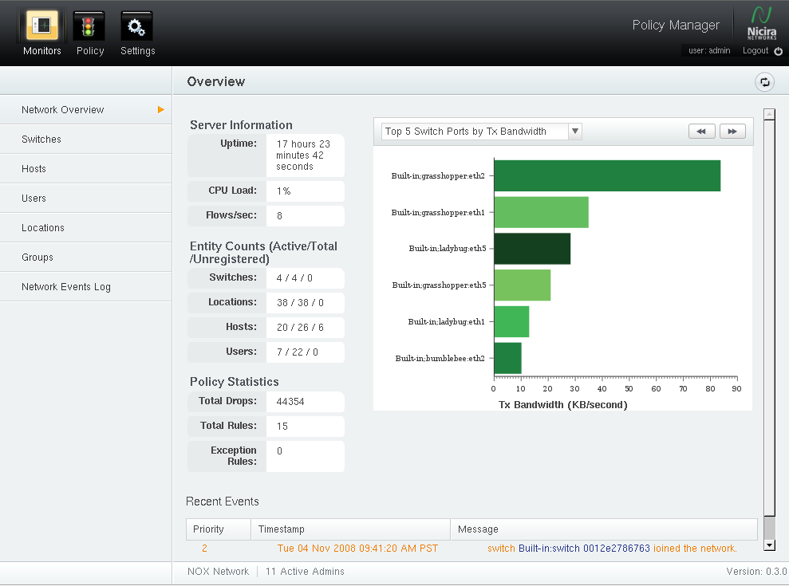

.. _using:

Policy Manager Overview
=========================

Monitors
---------

Network Overview
^^^^^^^^^^^^^^^^^

All setup and configuration is done through the Policy Manager
interface. The default password to log in is **admin/admin**.  This should
be changed immediately on first log in.  Instructions to change a users
password are covered in :ref:`user_management`.

Directories and Principal Management
-------------------------------------

Network Policies
-----------------

Logging
--------
